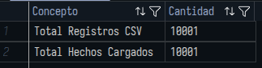
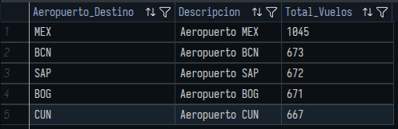
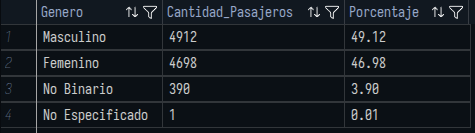
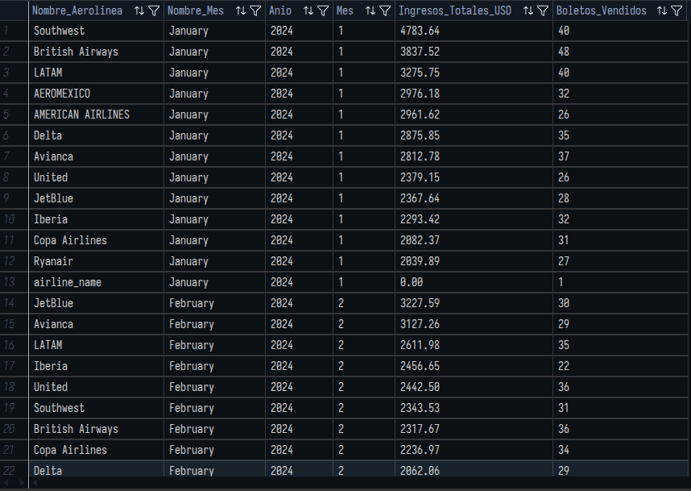
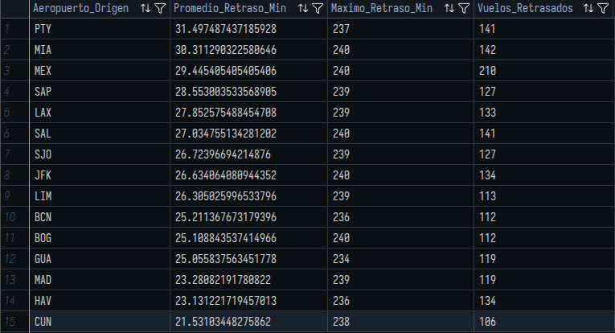
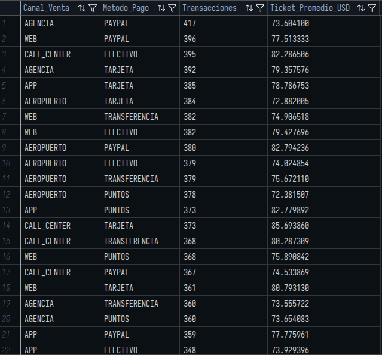
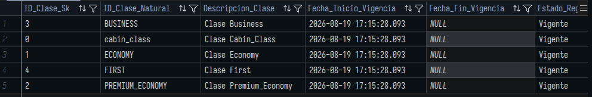

# Práctica 1 — Seminario de Sistemas 2

## Proceso ETL y Modelado Multidimensional para Inteligencia de Negocios

**Integrantes:** 

| Carné     | Estudiante                     |
|-----------|--------------------------------|
| 201901108 | Walter Daniel Jiménez Hernandez |
| 201020697 | Esteban Palacios Kestler       |
| 202000886 | José Ricardo Menocal Kong      |


---

## 1. Descripción del proyecto y escenario

Este proyecto implementa un proceso ETL (Extracción, Transformación y Carga) con **Python** y **Microsoft SQL Server**, sobre un escenario de registros de vuelos comerciales (`dataset_vuelos_crudo.csv`, 10,000 registros + encabezado).

El dataset crudo presenta problemas típicos de calidad de datos: fechas en formatos mixtos, precios con separador decimal europeo, texto sin homologar (mayúsculas/minúsculas mezcladas) y valores nulos. El objetivo final es poblar un **modelo multidimensional en esquema de estrella** que soporte consultas analíticas para la toma de decisiones, incluyendo una dimensión de cambio lento **Tipo 2 (SCD2)**.

## 2. Arquitectura y tecnologías utilizadas

| Componente | Detalle |
|---|---|
| Lenguaje ETL | Python 3.10+ |
| Librerías | `pandas`, `pyodbc`, `python-dotenv`, `datetime` |
| Motor de base de datos | Microsoft SQL Server |
| Configuración | Archivo `.env` (no versionado, ver `.gitignore`) para credenciales de conexión |

## 3. Estructura del repositorio

```
Practica1/
├── database/
│   ├── ddl_creacion_tablas.sql   # DDL del modelo en estrella (DB_VuelosBI)
│   └── Consultas.sql             # 7 consultas analíticas
├── doc/
│   └── img/                      # Diagrama del modelo y capturas de resultados
├── dataset_vuelos_crudo.csv      # Fuente cruda (10,000 filas + encabezado)
├── etl_vuelos.py                 # Script ETL (extracción, transformación, carga)
├── requirements.txt              # Dependencias de Python
├── .env.example                  # Plantilla de variables de conexión
├── .gitignore
└── README.md                     # Este documento
```

## 4. Diseño del modelo multidimensional (SQL Server)

Se implementó un **esquema de estrella** (`ddl_creacion_tablas.sql`, base de datos `DB_VuelosBI`):


- **Tabla de hechos `Hechos_Vuelos`**: métricas (`Precio_USD`, `Duracion_Minutos`, `Retraso_Minutos`, `Equipaje`) y hechos degenerados (`Numero_Vuelo`, `Estado_Vuelo`, `Canal_Venta`, `Metodo_Pago`), con FKs hacia todas las dimensiones e integridad referencial declarada.
- **`Dim_Tiempo`**: año, mes, día, día de la semana, trimestre.
- **`Dim_Aerolinea`**: código IATA y nombre.
- **`Dim_Aeropuerto`**: código IATA y descripción (origen/destino).
- **`Dim_Pasajero`**: UUID, género, edad, país de origen.
- **`Dim_Clase_SCD2`** (dimensión de cambio lento Tipo 2, requisito obligatorio): llave subrogada `ID_Clase_Sk`, llave natural `ID_Clase_Natural`, `Fecha_Inicio_Vigencia`, `Fecha_Fin_Vigencia` y flag `Es_Actual`.

Diagrama generado desde el motor de base de datos:


## 5. Proceso ETL (`etl_vuelos.py`)

### Fase 1 — Extracción
Lectura de `dataset_vuelos_crudo.csv` con `pandas` (`header=0`, respetando la fila de encabezado real del archivo) y asignación de nombres lógicos de columna por posición (26 columnas).

### Fase 2 — Transformación
- Homologación de género (`M/Masculino` → `Masculino`, `F/Femenino` → `Femenino`, `X/NoBinario` → `No Binario`).
- Estandarización de texto: códigos (aerolínea, aeropuertos, número de vuelo, estado, clase, canal, método de pago, moneda, país) a mayúsculas; nombre de aerolínea a *Title Case*; eliminación de espacios en blanco residuales.
- Parseo robusto de fechas probando 4 máscaras distintas (`salida`, `llegada`, `fecha_compra`).
- Normalización de precios con coma decimal europea a formato numérico estándar.
- Relleno de nulos controlado (`SIN_DATO` para texto, `0` para métricas).
- Truncamiento de longitud de campos de texto para no exceder el tamaño definido en el DDL.
- Cálculo del precio promedio por clase (`precio_usd`) usado como atributo de detección de cambios en la dimensión SCD2.

### Fase 3 — Carga
- Conexión a SQL Server vía `pyodbc` usando credenciales de `.env`.
- Carga idempotente de dimensiones (`IF NOT EXISTS`).
- Carga de `Dim_Clase_SCD2` con **detección real de cambios**: si la clase no tiene versión vigente se inserta; si existe una versión vigente y su descripción o precio promedio cambiaron, se cierra la versión anterior (`Es_Actual = 0`, `Fecha_Fin_Vigencia`) y se inserta la nueva versión vigente, preservando el historial.
- *Lookups* de llaves subrogadas cargados en memoria (diccionarios) para evitar consultas fila por fila.
- Inserción transaccional en `Hechos_Vuelos` con todas las FKs resueltas.

## 6. Instrucciones de ejecución

**Requisitos previos:** SQL Server accesible (local, contenedor Docker, o remoto), Python 3.10+, driver ODBC 18 para SQL Server.

1. **Crear el esquema:** ejecutar `database/ddl_creacion_tablas.sql` contra el servidor (crea `DB_VuelosBI` y sus tablas).
2. **Entorno Python:**
   ```
   python -m venv .venv
   .venv\Scripts\activate        # Windows
   pip install -r requirements.txt
   ```
3. **Configurar credenciales** — copiar `.env.example` a `.env` y ajustar los valores según tu servidor:
   ```
   DB_SERVER=<servidor>
   DB_NAME=DB_VuelosBI
   DB_USER=<usuario>
   DB_PASSWORD=<password>
   DB_DRIVER={ODBC Driver 18 for SQL Server}
   ```
4. **Ejecutar el ETL:**
   ```
   python etl_vuelos.py
   ```
5. **Ejecutar consultas analíticas:** abrir y correr `database/Consultas.sql` contra `DB_VuelosBI`.

## 7. Resultados y consultas analíticas

Las siguientes capturas (`doc/img/`) corresponden a una ejecución del ETL previa a las correcciones descritas en la sección 5 (estandarización de texto, lectura correcta del encabezado del CSV y detección de cambios en el SCD2). Antes de la entrega final se debe volver a ejecutar el proceso contra una base de datos limpia y regenerar las capturas de las consultas 1, 3, 4 y 7.

### Consulta 1 — Validación de conteos


Compara el total de filas del CSV contra el total cargado en `Hechos_Vuelos`. El valor 10,001 corresponde a la ejecución previa a la corrección de lectura del encabezado (ver sección 5); tras la corrección, el total esperado es de 10,000 vuelos.

### Consulta 2 — Top 5 destinos más frecuentes


MEX lidera con 1,045 vuelos, seguido de BCN (673) y SAP (672).

### Consulta 3 — Distribución de pasajeros por género


49.12% Masculino, 46.98% Femenino, 3.90% No Binario. El registro "No Especificado" que aparece en esta captura corresponde a la fila de encabezado mal leída en la ejecución previa a la corrección; no debería reaparecer tras regenerar la consulta.

### Consulta 4 — Ingresos por aerolínea y mes


Southwest Airlines lidera ingresos en enero 2024. La fila `airline_name` con `$0.00` (fila 13) es la misma evidencia del registro corrupto de la ejecución previa a la corrección; no debería reaparecer tras regenerar la consulta.

### Consulta 5 — Promedio de retraso por aeropuerto de origen


PTY, MIA y MEX presentan los mayores promedios de retraso (>29 min).

### Consulta 6 — Ventas por canal y método de pago


Agencia+PayPal y Web+PayPal concentran el mayor número de transacciones; el ticket promedio se mantiene entre $72 y $86 USD en todos los cruces.

### Consulta 7 — Validación de la dimensión SCD2


Muestra las 5 clases de vuelo cargadas, todas como `Vigente` (`Es_Actual = 1`, `Fecha_Fin_Vigencia = NULL`), y la clase `cabin_class` proveniente del registro corrupto ya corregido. Con la detección de cambios implementada en la sección 5, se recomienda regenerar esta consulta y, adicionalmente, ejecutar un segundo `run` del ETL con un precio promedio distinto para capturar un registro histórico real (`Es_Actual = 0`) que demuestre el funcionamiento completo del SCD2.
