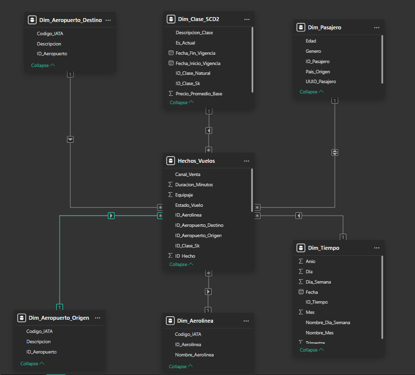
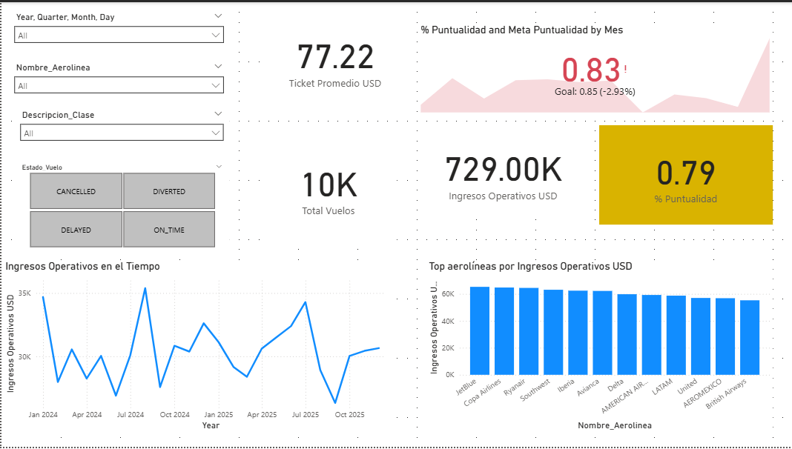
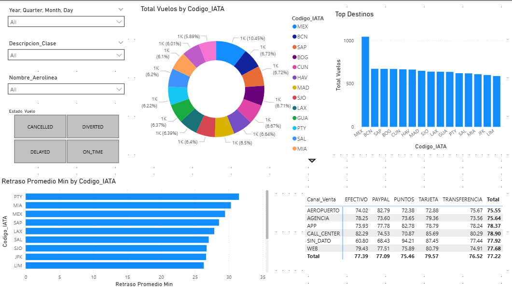
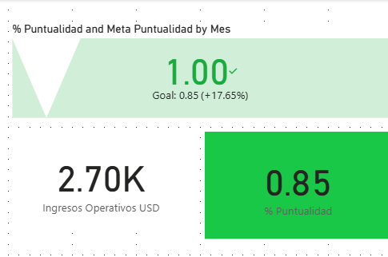

# Práctica 2 — Seminario de Sistemas 2

## Diseño de Dashboard y KPIs con Power BI

**Integrantes:**

| Carné     | Estudiante                     |
|-----------|--------------------------------|
| 201901108 | Walter Daniel Jiménez Hernandez |
| 201020697 | Esteban Palacios Kestler       |
| 202000886 | José Ricardo Menocal Kong      |

---

## 1. Objetivo

Conectar Power BI a la base de datos relacional `DB_VuelosBI` generada en la Práctica 1, diseñar un modelo tabular con relaciones y jerarquías, construir medidas DAX y un KPI con semáforo, y presentar un dashboard interactivo que apoye decisiones estratégicas sobre la operación de vuelos (ingresos, puntualidad, cancelaciones y comportamiento de clientes).

## 2. Estructura del repositorio

```
Practica2/
├── tablero_g9.pbix        # Archivo Power BI: conexión, modelo, medidas y dashboard
├── modelo-estrella.png    # Captura del modelo tabular (vista Modelo de Power BI)
├── screenshots/           # Capturas de cada página del dashboard
├── 798_Practica_2_2S2026.pdf
└── README.md              # Este documento
```

## 3. Fuente de datos y conexión

- **Motor:** Microsoft SQL Server, base de datos `DB_VuelosBI` (poblada por el ETL de la Práctica 1).
- **Modo de conectividad en Power BI:** Importar.
- **Tablas conectadas:** `Hechos_Vuelos`, `Dim_Tiempo`, `Dim_Aerolinea`, `Dim_Aeropuerto` (referenciada dos veces, ver sección 4), `Dim_Pasajero`, `Dim_Clase_SCD2`.

## 4. Diseño del modelo tabular

Se implementó un **esquema de estrella** con `Hechos_Vuelos` como tabla de hechos central y cinco dimensiones alrededor.



### 4.1 Manejo de la dimensión de rol (Aeropuerto)

`Hechos_Vuelos` referencia dos veces a `Dim_Aeropuerto` (`ID_Aeropuerto_Origen` e `ID_Aeropuerto_Destino`). Como Power BI solo permite una relación activa por par de tablas, se resolvió duplicando la tabla en Power Query mediante **Referencia**, generando `Dim_Aeropuerto_Origen` y `Dim_Aeropuerto_Destino`, cada una con su propia relación activa hacia el hecho. Esto evita depender de `USERELATIONSHIP()` en cada medida y simplifica el uso de segmentadores independientes para origen y destino.

### 4.2 Relaciones

| Dimensión (lado 1) | Hecho (lado *) |
|---|---|
| `Dim_Tiempo[ID_Tiempo]` | `Hechos_Vuelos[ID_Tiempo]` |
| `Dim_Aerolinea[ID_Aerolinea]` | `Hechos_Vuelos[ID_Aerolinea]` |
| `Dim_Aeropuerto_Origen[ID_Aeropuerto]` | `Hechos_Vuelos[ID_Aeropuerto_Origen]` |
| `Dim_Aeropuerto_Destino[ID_Aeropuerto]` | `Hechos_Vuelos[ID_Aeropuerto_Destino]` |
| `Dim_Pasajero[ID_Pasajero]` | `Hechos_Vuelos[ID_Pasajero]` |
| `Dim_Clase_SCD2[ID_Clase_Sk]` | `Hechos_Vuelos[ID_Clase_Sk]` |

`Dim_Tiempo` se marcó como **tabla de fechas** (columna `Fecha`) para habilitar funciones de time intelligence (`DATEADD`, `SAMEPERIODLASTYEAR`).

### 4.3 Jerarquías

- **Dim_Tiempo (obligatoria):** `Anio > Trimestre > Mes > Dia`, para permitir drill-down temporal en los gráficos de tendencia.
- **Dim_Pasajero (complementaria):** `Pais_Origen > Genero`, para segmentación demográfica de pasajeros.

### 4.4 Decisiones de diseño

- Se ocultaron del panel de campos las llaves técnicas (`ID_Hecho` y todas las FK/SK) que no aportan valor analítico directo, dejando visibles solo los atributos descriptivos y las medidas.
- Se excluyen los vuelos `CANCELLED` de las medidas de ingresos y ticket promedio, para que reflejen ingresos operativos reales y no boletos que no se concretaron.
- El cálculo de puntualidad solo considera vuelos con estado `ON_TIME` o `DELAYED` (vuelos que efectivamente salieron), excluyendo `CANCELLED` y `DIVERTED` del denominador.

## 5. Medidas DAX

| Medida | Expresión | Propósito |
|---|---|---|
| `Total Vuelos` | `COUNTROWS(Hechos_Vuelos)` | Volumen total de registros de vuelo |
| `Ingresos Totales USD` | `SUM(Hechos_Vuelos[Precio_USD])` | Ingresos brutos sin filtrar estado |
| `Ingresos Operativos USD` | `CALCULATE([Ingresos Totales USD], Hechos_Vuelos[Estado_Vuelo] <> "CANCELLED")` | Ingresos reales (excluye cancelados) |
| `Vuelos Operativos` | `CALCULATE([Total Vuelos], Hechos_Vuelos[Estado_Vuelo] <> "CANCELLED")` | Base para ticket promedio |
| `Ticket Promedio USD` | `DIVIDE([Ingresos Operativos USD], [Vuelos Operativos])` | Precio promedio por boleto vendido |
| `Pasajeros Distintos` | `DISTINCTCOUNT(Hechos_Vuelos[ID_Pasajero])` | Alcance de clientes únicos |
| `Equipaje Promedio` | `AVERAGE(Hechos_Vuelos[Equipaje])` | Piezas de equipaje promedio por vuelo |
| `Vuelos Cancelados` | `CALCULATE([Total Vuelos], Hechos_Vuelos[Estado_Vuelo] = "CANCELLED")` | Volumen de cancelaciones |
| `% Cancelacion` | `DIVIDE([Vuelos Cancelados], [Total Vuelos])` | Tasa de cancelación |
| `Vuelos Operados` | `CALCULATE([Total Vuelos], Hechos_Vuelos[Estado_Vuelo] IN {"ON_TIME","DELAYED"})` | Vuelos que sí salieron |
| `Vuelos Retrasados` | `CALCULATE([Total Vuelos], Hechos_Vuelos[Estado_Vuelo] IN {"ON_TIME","DELAYED"}, Hechos_Vuelos[Retraso_Minutos] > 0)` | Vuelos con retraso |
| `% Puntualidad` | `1 - DIVIDE([Vuelos Retrasados], [Vuelos Operados])` | KPI de desempeño operativo |
| `Retraso Promedio Min` | `CALCULATE(AVERAGE(Hechos_Vuelos[Retraso_Minutos]), Hechos_Vuelos[Estado_Vuelo] IN {"ON_TIME","DELAYED"})` | Minutos de retraso promedio |
| `Ingresos Mes Anterior` | `CALCULATE([Ingresos Operativos USD], DATEADD(Dim_Tiempo[Fecha], -1, MONTH))` | Comparativo mes a mes |
| `% Crecimiento MoM` | `DIVIDE([Ingresos Operativos USD] - [Ingresos Mes Anterior], [Ingresos Mes Anterior])` | Crecimiento mensual de ingresos |
| `Ingresos Año Anterior` | `CALCULATE([Ingresos Operativos USD], SAMEPERIODLASTYEAR(Dim_Tiempo[Fecha]))` | Comparativo año a año |
| `% Crecimiento YoY` | `DIVIDE([Ingresos Operativos USD] - [Ingresos Año Anterior], [Ingresos Año Anterior])` | Crecimiento interanual de ingresos |

## 6. KPI con semáforo: Puntualidad operativa

**Meta de negocio:** `Meta Puntualidad = 0.85` (85% de vuelos a tiempo).

```dax
Semaforo Puntualidad (texto) =
SWITCH(TRUE(),
    [% Puntualidad] >= 0.85, "🟢 Cumple meta",
    [% Puntualidad] >= 0.70, "🟡 En riesgo",
    "🔴 Bajo desempeño"
)
```

**Semaforización:**

| Rango de `% Puntualidad` | Estado |
|---|---|
| ≥ 85% | 🟢 Cumple meta |
| 70% – 84.9% | 🟡 En riesgo |
| < 70% | 🔴 Bajo desempeño |

Se implementó como tarjeta con formato condicional (color de fondo según las reglas anteriores) y como visual nativo **KPI** de Power BI, usando `% Puntualidad` como indicador, `Meta Puntualidad` como valor objetivo y la jerarquía de `Dim_Tiempo` (mes) como eje de tendencia.

**Resultado obtenido:** El valor actual de % Puntualidad es de 79 % y estado del semáforo tras ejecutar el dashboard es amarillo

## 7. Dashboard: páginas y visualizaciones

### Página 1 — Resumen Ejecutivo
- Tarjetas: `Total Vuelos`, `Ingresos Operativos USD`, `Ticket Promedio USD`.
- KPI con semáforo: `% Puntualidad` vs. `Meta Puntualidad`.
- Gráfico de líneas: `Ingresos Operativos USD` por `Dim_Tiempo` (jerarquía Año/Trimestre/Mes).
- Gráfico de barras: Top aerolíneas por `Ingresos Operativos USD`.

### Página 2 — Operaciones y Clientes
- Barras: `Retraso Promedio Min` por `Dim_Aeropuerto_Origen[Codigo_IATA]`.
- Barras/tabla: `Total Vuelos` por `Dim_Aeropuerto_Destino[Codigo_IATA]` (top destinos).
- Gráfico de dona: `Total Vuelos` por `Dim_Pasajero[Genero]`.
- Matriz: `Canal_Venta` × `Metodo_Pago` con `Ticket Promedio USD`.

### Filtros / segmentadores (reporte completo)
- Rango de fechas (`Dim_Tiempo[Fecha]`).
- Aerolínea (`Dim_Aerolinea[Nombre_Aerolinea]`).
- Estado del vuelo (`Hechos_Vuelos[Estado_Vuelo]`).
- Clase de servicio (`Dim_Clase_SCD2[Descripcion_Clase]`).

Capturas: 

### Página 1 — Resumen Ejecutivo


### Página 2 — Operaciones y Clientes


### KPI de Puntualidad (semáforo)


### Vista Modelo — Relaciones


| Archivo | Contenido esperado |
|---|---|
| `screenshots/resumen_ejecutivo.png` | Página 1 completa (tarjetas, KPI, líneas, barras, segmentadores) |
| `screenshots/operaciones_clientes.png` | Página 2 completa (retraso por origen, top destinos, dona género, matriz canal/pago) |
| `screenshots/kpi_puntualidad.png` | Acercamiento al KPI de puntualidad mostrando el color del semáforo |
| `screenshots/modelo_relaciones.png` | Vista Modelo de Power BI con el esquema de estrella y relaciones activas |


## 8. Interpretación de resultados

** Se analizó todo el histórico **
- Ingresos operativos totales del período analizado: `729.00 K USD`.
- Aerolínea con mayores ingresos: `JetBlue`.
- % de puntualidad global y su interpretación frente a la meta del 85%: `La tasa de puntuelidas es del 79% menor al objetivo, es necesario identificar las aerolineas con mayor retraso reportado para el plan de acción`.
- Aeropuerto(s) de origen con mayor retraso promedio y posibles causas: `PTY presenta mayor restraso con 31 minutos en promedio, no se puede argumentar que sea por gran fuelcia ya que el gráfico de top destino no figura PTY`.
- % de cancelación y su impacto en los ingresos: `560/10000 -> 5.6% no se muestra impacto en los ingresos ya que no se analizan datos de devolución de efectivo`.
- Canal de venta / método de pago dominante: `El canal de venta dominante es CALL_CENTER con 80.29 ticket promedio y el método de pago preferido es con Tarjeta`.
- Relevancia estratégica: 
 - Nos permiten reforzar operación en aeropuertos con más retraso
 - Renegociar con aerolíneas de bajo desempeño
 - Priorizar canales de venta más rentables

## 9. Cómo abrir y ejecutar el archivo

1. Verificar que el servidor SQL Server con `DB_VuelosBI` esté accesible (mismas credenciales usadas en la Práctica 1).
2. Abrir `tablero_g9.pbix` con Power BI Desktop.
3. Si Power BI solicita credenciales de origen de datos, ingresar las del servidor SQL Server.
4. Usar **Actualizar** para refrescar los datos si la base de datos cambió desde la última carga.
