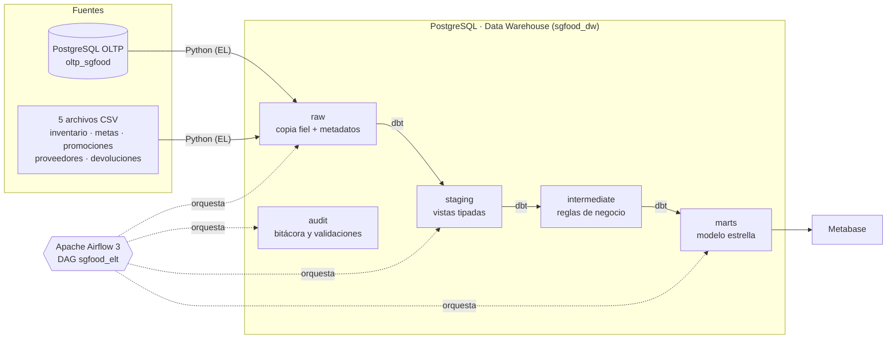
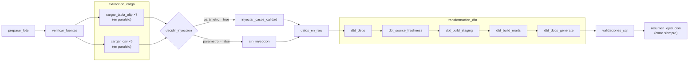
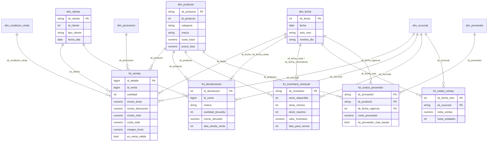
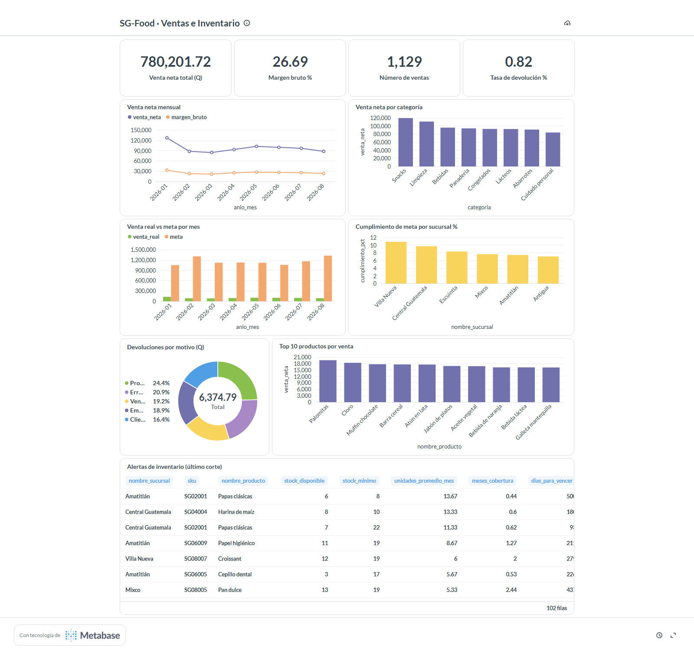

# Proyecto 1 · Flujo moderno de datos para SG-Food

**Universidad de San Carlos de Guatemala** · Facultad de Ingeniería · Ingeniería en Ciencias y Sistemas
**Laboratorio de Seminario de Sistemas 2** · Segundo Semestre 2026 · **Grupo 9**

Implementación de un flujo **ELT** con **Python**, **Apache Airflow 3**, **dbt Core** y **PostgreSQL**: extrae una base transaccional y archivos CSV, los carga a un Data Warehouse, los transforma en un modelo estrella con pruebas de calidad y los valida automáticamente. El tablero en **Metabase** consume el modelo analítico.

## Integrantes

| Carné     | Estudiante                      |
|-----------|---------------------------------|
| 201901108 | Walter Daniel Jiménez Hernandez |
| 201020697 | Esteban Palacios Kestler        |
| 202000886 | José Ricardo Menocal Kong       |

## Contenido

1. [Problema y solución](#1-problema-y-solución)
2. [Arquitectura](#2-arquitectura)
3. [Fuentes de datos](#3-fuentes-de-datos)
4. [Extracción y carga con Python](#4-extracción-y-carga-con-python)
5. [DAG de Airflow](#5-dag-de-airflow)
6. [Data Warehouse](#6-data-warehouse)
7. [Proyecto dbt](#7-proyecto-dbt)
8. [Validación y calidad de datos](#8-validación-y-calidad-de-datos)
9. [Consultas analíticas y tablero](#9-consultas-analíticas-y-tablero)
10. [Justificación del diseño](#10-justificación-del-diseño)
11. [Manual de implementación](#11-manual-de-implementación)
12. [Estructura del repositorio](#12-estructura-del-repositorio)
13. [Evidencia de ejecución](#13-evidencia-de-ejecución)
14. [Guía para la calificación](#14-guía-para-la-calificación)

---

## 1. Problema y solución

SG-Food distribuye productos de varias marcas y categorías. Sus reportes salían directamente de la base transaccional, con procesos manuales, sin trazabilidad de las transformaciones y sin pruebas de calidad.

La solución separa la operación del análisis:

- **Python** extrae la base transaccional y los CSV y los carga **sin transformar** al schema `raw` del Data Warehouse.
- **dbt** transforma por capas (`staging` → `intermediate` → `marts`) hasta un **modelo estrella**, con **156 pruebas de datos** y documentación automática.
- **Airflow** orquesta todo diariamente con reintentos, manejo de errores y una bitácora de cada corrida.
- **34 validaciones SQL** reconcilian el resultado de punta a punta.
- **Metabase** muestra ventas, metas, devoluciones e inventario sin tocar la base transaccional.

## 2. Arquitectura



Todo corre en Docker con un solo `docker compose`:

| Servicio | Imagen | Puerto local | Función |
|---|---|---|---|
| `oltp-db` | postgres:16 | 55433 | Fuente transaccional; se carga sola con `sql/oltp/01_sgfood_oltp.sql` |
| `dw-db` | postgres:16 | 55434 | Data Warehouse; se crea solo con `sql/dw/00_ddl_datawarehouse.sql` |
| `airflow-db` | postgres:16 | — | Metadatos de Airflow |
| `airflow-apiserver` | sgfood-airflow:3.3.2 | 8080 | Interfaz web y API de Airflow |
| `airflow-scheduler` | sgfood-airflow:3.3.2 | — | Planificador y ejecutor (LocalExecutor) |
| `airflow-dag-processor` | sgfood-airflow:3.3.2 | — | Lee los DAGs de `dags/` |
| `metabase` (perfil `bi`) | metabase/metabase:v0.64.1.1 | 3000 | Tablero de visualización |

La imagen `sgfood-airflow` es Airflow 3.3.2 con **dbt 1.12 en un virtualenv aislado** (`/opt/dbt-venv`). Así se evitan conflictos de dependencias entre Airflow y dbt.

## 3. Fuentes de datos

El curso proporcionó los datos y su diccionario: [docs/catalogo_insumos_sgfood.xlsx](docs/catalogo_insumos_sgfood.xlsx).

| Fuente | Tipo | Contenido | Filas |
|---|---|---|---|
| `sgfood_oltp.sql` | BD transaccional | sucursal (6), categoria (8), marca (10), producto (80), cliente (250), venta (1,200), venta_detalle (3,209) | 4,763 |
| `inventario_bodega.csv` | CSV | Foto de inventario al cierre de mes × sucursal × producto (ene–ago 2026) | 3,840 |
| `metas_ventas.csv` | CSV | Meta mensual en quetzales y unidades por sucursal | 48 |
| `promociones.csv` | CSV | Descuento por categoría y rango de fechas | 30 |
| `proveedores_precios.csv` | CSV | Costo y plazo por proveedor y producto | 103 |
| `devoluciones.csv` | CSV | Devoluciones con su motivo | 80 |
| `casos_calidad_opcionales.csv` | CSV de prueba | 10 errores intencionales. **No se cargan en la corrida normal** | 10 |

## 4. Extracción y carga con Python

Paquete [`src/sgfood_elt`](src/sgfood_elt/), configurado en [`config/pipeline.yaml`](config/pipeline.yaml). Agregar una tabla o un archivo nuevo solo requiere una entrada en el YAML.

| Módulo | Responsabilidad |
|---|---|
| `config.py` | Credenciales desde variables de entorno (`.env`) y fuentes desde el YAML. No hay credenciales en el código |
| `db.py` | Conexiones con 3 reintentos y espera exponencial |
| `extract.py` | OLTP: cursor del lado del servidor, lectura por partes. CSV: valida el encabezado y el número de columnas por fila |
| `load.py` | Carga con `COPY` dentro de una sola transacción (`TRUNCATE + COPY`) o incremental (`DELETE + INSERT` por llave) |
| `audit.py` | Registra cada carga en `audit.etl_load_log` (RUNNING → SUCCESS/FAILED, filas y error) |
| `pipeline.py` | Una función por tabla o archivo (la usa Airflow), verificación previa de fuentes y resumen de la corrida |
| `quality_cases.py` | Inyecta los 10 casos de `casos_calidad_opcionales.csv` (solo para demostrar las pruebas) |
| `validate.py` | Ejecuta las validaciones SQL y la reconciliación OLTP → raw |

**Garantías de la carga:**

- **Atómica e idempotente.** Si algo falla, `raw` queda exactamente como estaba; re-ejecutar da el mismo resultado.
- **Reconciliada.** Después de cada carga se compara el conteo en destino con las filas extraídas; si no cuadran, la tarea falla.
- **Trazable.** Cada fila de `raw` lleva `_batch_id`, `_loaded_at` y `_source`; los CSV llevan además `_row_number`, la fila exacta del archivo.
- **Segura.** Se extrae con el usuario `etl_reader`, de **solo lectura** en el OLTP.
- **Incremental opcional.** El modo `incremental` (por tabla, en el YAML) re-extrae desde el último watermark menos una ventana de 7 días. Así se captan cambios de estado como PENDIENTE → COMPLETADA. Por defecto se usa carga completa, porque el OLTP no tiene columna `updated_at` y el volumen es pequeño.

## 5. DAG de Airflow

Archivo [`dags/sgfood_elt_dag.py`](dags/sgfood_elt_dag.py), escrito con el SDK de Airflow 3.



| Aspecto | Configuración |
|---|---|
| Programación | Diario a las **06:00 (America/Guatemala)**, `catchup=False`, máximo 1 corrida activa |
| Paralelismo | *Dynamic task mapping*: una tarea por tabla o archivo, identificada por su nombre en la interfaz |
| Reintentos | 2 reintentos con espera exponencial (30 s → máx. 5 min) y timeout de 20 min por tarea. `dbt build` solo 1 reintento, porque un dato inválido no se corrige reintentando |
| Manejo de errores | `verificar_fuentes` falla rápido si falta una tabla o un CSV. El callback `alerta_fallo` registra `ALERTA SG-Food` con tarea, intento y error. `resumen_ejecucion` siempre deja el estado en `audit.pipeline_run` |
| Parámetro | `inyectar_casos_calidad` (boolean). Al dispararlo en `true` se demuestra que dbt detiene el flujo ante datos inválidos |
| Etapas de dbt | `build --select staging` valida la entrada **antes** de construir los marts. Si una prueba falla, los marts conservan su última versión buena |

## 6. Data Warehouse

Script DDL completo, idempotente: [`sql/dw/00_ddl_datawarehouse.sql`](sql/dw/00_ddl_datawarehouse.sql).

| Schema | Contenido | Quién lo crea |
|---|---|---|
| `raw` | 12 tablas espejo de las fuentes, **sin restricciones**, para que acepten incluso datos malos y dbt los detecte. Las `oltp_*` conservan los tipos; las `csv_*` son `TEXT` | DDL + Python |
| `staging` | 12 vistas: tipado, limpieza y renombrado | dbt |
| `intermediate` | 4 vistas con reglas de negocio | dbt |
| `marts` | 7 dimensiones + 5 hechos con PK/FK reales, y 2 tablas de reporte | DDL / dbt (contrato) |
| `audit` | `etl_load_log`, `load_watermark`, `validation_result`, `pipeline_run` | DDL |
| `test_failures` | Filas que fallaron cada prueba de dbt (`store_failures`) | dbt |

### Modelo estrella



| Hecho | Grano | Tipo |
|---|---|---|
| `fct_ventas` | Una línea de venta | Transaccional |
| `fct_devoluciones` | Una devolución (venta × producto) | Transaccional |
| `fct_inventario_mensual` | Cierre de mes × sucursal × producto | Foto periódica; el stock no se suma entre meses |
| `fct_metas_ventas` | Mes × sucursal | Agregado |
| `fct_costos_proveedor` | Proveedor × producto × fecha de vigencia | Transaccional |

Las dimensiones son `dim_fecha` (calendario 2025–2028 en español), `dim_producto` (con categoría y marca), `dim_cliente`, `dim_sucursal`, `dim_proveedor`, `dim_promocion` y `dim_condicion_venta`. Esta última es una dimensión *junk*: canal × método de pago × estado.

## 7. Proyecto dbt

```
dbt/sgfood/
├── dbt_project.yml        # capas, materializaciones, contrato, store_failures
├── profiles.yml           # credenciales por env_var()
├── packages.yml           # dbt_utils
├── macros/                # generate_schema_name, llaves (sk, sk_desconocido, sk_fecha)
├── models/
│   ├── staging/           # _sources.yml (2 sources + freshness), 12 stg_*, _stg_models.yml
│   ├── intermediate/      # int_productos_enriquecidos, int_ventas_lineas,
│   │                      # int_devoluciones_enriquecidas, int_costos_proveedor
│   └── marts/
│       ├── core/          # 7 dim_* + 5 fct_*  (contract: enforced → PK/FK reales)
│       └── reporting/     # mart_cumplimiento_metas, mart_alertas_inventario + exposure
└── tests/
    ├── generic/           # porcentaje_valido, no_apunta_a_desconocido (pruebas propias)
    └── assert_*.sql       # 8 pruebas singulares (reglas de negocio y reconciliación)
```

| Elemento | Implementación |
|---|---|
| **sources** | `oltp` y `archivos` sobre `raw`, con `freshness` en `_loaded_at` (avisa a las 24 h, falla a las 48 h) |
| **refs** | Todo modelo referencia a su capa anterior con `ref()`/`source()`; dbt deriva el linaje y el orden |
| **Materializaciones** | `view` en staging e intermediate; `table` en marts, con índices en las FK de los hechos |
| **Contratos** | En `marts/core`, dbt crea cada tabla con los tipos, PK y FK declarados (las mismas del DDL) |
| **Pruebas** | 156 en total: `unique`, `not_null`, `relationships`, `accepted_values`, `dbt_utils` (`accepted_range`, `unique_combination_of_columns`, `expression_is_true`), 2 genéricas propias y 8 singulares |
| **Severidades** | `error` para la integridad de los datos. `warn` para reglas de negocio que la fuente sí incumple y que deben revisarse con el negocio |
| **Documentación** | Descripciones en el YAML, `overview.md`, `exposure` del tablero y `dbt docs generate` en cada corrida (copia en [`docs/dbt_docs/`](docs/dbt_docs/)) |

## 8. Validación y calidad de datos

Hay tres niveles de control:

1. **Python:** encabezado y columnas del CSV, más la reconciliación de conteos tras cada carga.
2. **dbt:** 156 pruebas.
3. **SQL:** 34 validaciones posteriores a dbt, en [`sql/validation/`](sql/validation/). Cada consulta devuelve las filas que incumplen la regla y el DAG guarda el resultado en `audit.validation_result`.

| Archivo | Valida |
|---|---|
| `01_conteos.sql` | Tablas raw no vacías, conteos raw = marts, montos y unidades raw = hechos, cobertura de `dim_fecha` |
| `02_integridad_referencial.sql` | Huérfanos en raw (sin FK físicas) y en marts, hechos que apuntan al miembro desconocido, existencia de las 20 FK |
| `03_nulos_unicidad.sql` | Llaves nulas o duplicadas en raw, medidas nulas, unicidad de llaves naturales, un único miembro desconocido |
| `04_reglas_negocio.sql` | Montos consistentes, valores válidos, devoluciones ≤ lo vendido y posteriores a la venta, inventario sin negativos ni vencidos, metas positivas |
| `validate.py` | Reconciliación OLTP → raw por tabla (son bases de datos distintas) |

### Demostración con los casos de calidad

Al disparar el DAG con `inyectar_casos_calidad = true`, dbt detecta **los 10 casos**, detiene el flujo y **no actualiza los marts**:

| Caso inyectado | Prueba que lo detecta |
|---|---|
| NULL en identificador (cliente) | `not_null_stg_oltp__cliente_id_cliente` |
| Precio negativo | `dbt_utils.accepted_range` en `precio_lista` |
| FK huérfana (venta → cliente 999999) | `relationships` en `stg_oltp__venta.id_cliente` |
| Cantidad cero | `dbt_utils.accepted_range` (mín. 1) en `cantidad` |
| Descuento mayor a 100 % | `porcentaje_valido` (prueba propia) |
| Stock negativo | `dbt_utils.accepted_range` en `stock_disponible` |
| Vencimiento anterior al corte | `assert_vencimiento_posterior_al_corte` |
| Costo nulo | `not_null` en `costo_proveedor` |
| Meta cero | `dbt_utils.accepted_range` (exclusivo) en `meta_ventas` |
| Devolución superior a venta | `assert_devolucion_no_supera_vendido` |

### Hallazgos en los datos fuente

Las pruebas encontraron anomalías **reales** del dataset. Se reportan como advertencia, sin detener el pipeline:

- **265** registros de inventario con existencias **por encima del máximo** definido.
- **40** ventas con fecha **anterior a la fecha de alta** del cliente.
- **7** pares de **promociones traslapadas** en la misma categoría. El modelo aplica la de mayor descuento.
- Las **metas mensuales son ~10 veces la venta real**: ninguna sucursal supera el 11 % de cumplimiento. Conviene revisar con el área comercial cómo se definen las metas.

## 9. Consultas analíticas y tablero

[`sql/analytics/consultas_analiticas.sql`](sql/analytics/consultas_analiticas.sql) contiene 13 consultas de negocio, todas ejecutables con el usuario de solo lectura `bi_reader`:

- Tendencia mensual con variación y ticket promedio (Q1).
- Categorías y marcas por venta y margen (Q2).
- Top 10 productos (Q3).
- Cumplimiento de metas por sucursal (Q4).
- Canales y tasa de anulación (Q5).
- Efecto de las promociones (Q6).
- Devoluciones por motivo (Q7).
- Estado del inventario y productos a reabastecer (Q8, Q9).
- Valor del inventario en el tiempo (Q10).
- Tipos de cliente (Q11).
- Proveedor más barato (Q12).
- Ventas por día de la semana (Q13).

Los resultados están en [`docs/evidencia/consultas_analiticas_resultados.txt`](docs/evidencia/consultas_analiticas_resultados.txt).

**Tablero en Metabase.** [`scripts/setup_metabase.py`](scripts/setup_metabase.py) lo crea automáticamente: 4 KPIs y 7 visualizaciones sobre `marts`, conectados con el usuario `bi_reader`.



## 10. Justificación del diseño

| Decisión | Por qué |
|---|---|
| **ELT** en lugar de ETL | Python solo mueve datos y la lógica vive en dbt (SQL versionado, probado y documentado). Cambiar una regla de negocio no requiere tocar la carga |
| OLTP y DW en **instancias separadas** | Los reportes dejan de cargar la base transaccional, que era el problema original de SG-Food |
| `raw` **sin restricciones** y CSV como `TEXT` | Si `raw` rechazara datos inválidos, se perderían sin rastro. Así llegan, dbt los detecta y quedan en `test_failures` |
| **Pruebas de entrada en staging**, separadas de los marts | Un dato malo detiene el flujo antes de los marts: el tablero nunca muestra datos corruptos |
| **Modelo estrella** (no copo de nieve) | Categoría y marca van dentro de `dim_producto`: menos joins y consultas más simples para el análisis |
| **Grano de línea** en ventas | Permite analizar por producto, categoría y promoción; `id_venta` como dimensión degenerada permite contar tickets |
| **Llaves sustitutas md5** de la llave natural | Son deterministas: dbt reconstruye las tablas en cada corrida y las llaves no cambian |
| **Miembro desconocido** (-1) en cada dimensión | Un hecho con FK huérfana no se pierde ni rompe la FK; la prueba `no_apunta_a_desconocido` lo reporta |
| **Contrato de dbt** con PK/FK | La integridad referencial la garantiza PostgreSQL, no solo las pruebas |
| **Inventario como foto periódica** | Es como llega el dato (cierre de mes). El stock no se suma a través del tiempo |
| **Carga completa** por defecto | El OLTP no tiene `updated_at` y el estado de una venta cambia. Con este volumen, la carga completa es lo más simple y robusto; el modo incremental queda disponible |
| **Una tarea de Airflow por tabla** | Paralelismo, reintento individual y diagnóstico claro de qué falló |
| **Usuarios de solo lectura** (`etl_reader`, `bi_reader`) | Mínimo privilegio: el pipeline no puede modificar el OLTP y Metabase solo ve `marts` |

## 11. Manual de implementación

### Requisitos

- **Docker Desktop** (Windows/macOS) o Docker Engine + Compose v2 (Linux), con **6 GB de RAM** o más asignados.
- **Git**.
- **Python 3.10+.** Solo hace falta para ejecutar sin Airflow o para el script de Metabase.

### Paso 1 · Clonar y configurar

```bash
git clone <url-del-repositorio> SS22S2026_G9
cd SS22S2026_G9/Proyecto1
cp .env.example .env          # Windows PowerShell: copy .env.example .env
```

Edita `.env` y genera una clave Fernet y un secreto JWT propios:

```bash
python -c "import base64,os; print(base64.urlsafe_b64encode(os.urandom(32)).decode())"   # AIRFLOW_FERNET_KEY
python -c "import secrets; print(secrets.token_urlsafe(48))"                             # AIRFLOW_JWT_SECRET
```

Si los puertos `55433`, `55434`, `8080` o `3000` están ocupados, cámbialos en `.env` (`OLTP_PORT`, `DW_PORT`, `AIRFLOW_PORT`, `METABASE_PORT`).

### Paso 2 · Levantar la plataforma

```bash
docker compose up -d --build
```

La primera vez construye la imagen de Airflow con dbt (~5 min). Al arrancar:

- `oltp-db` carga la base transaccional y crea el usuario `etl_reader`.
- `dw-db` ejecuta el DDL y crea el usuario `bi_reader`.
- `airflow-init` migra la base de Airflow.

Verifica que todo esté arriba:

```bash
docker compose ps        # los servicios deben aparecer "healthy"
```

### Paso 3 · Ejecutar el pipeline en Airflow

1. Abre **http://localhost:8080** (usuario `admin`, contraseña `AIRFLOW_ADMIN_PASSWORD` del `.env`).
2. Activa el DAG **`sgfood_elt`** con el interruptor. Queda programado diario a las 06:00.
3. Para ejecutarlo ahora: **Trigger** → deja `inyectar_casos_calidad = false` → **Trigger**.
4. La corrida tarda ~3 minutos. Todas las tareas deben terminar en verde; `inyectar_casos_calidad` aparece como *skipped*.

Alternativa por consola:

```bash
docker exec sgfood-airflow-scheduler airflow dags unpause sgfood_elt
docker exec sgfood-airflow-scheduler airflow dags trigger sgfood_elt
```

### Paso 4 · Verificar los resultados

```bash
# Resumen de la corrida
docker exec sgfood-dw-db psql -U dw_admin -d sgfood_dw -c "SELECT * FROM audit.pipeline_run ORDER BY finished_at DESC;"
# Detalle de cargas y validaciones
docker exec sgfood-dw-db psql -U dw_admin -d sgfood_dw -c "SELECT source_name, rows_loaded, status FROM audit.etl_load_log ORDER BY id_log DESC LIMIT 12;"
docker exec sgfood-dw-db psql -U dw_admin -d sgfood_dw -c "SELECT check_name, severity, failing_rows, passed FROM audit.validation_result ORDER BY id_result DESC LIMIT 34;"
```

Para ejecutar a mano las validaciones o las consultas analíticas (por ejemplo, desde DBeaver o pgAdmin), conéctate a `localhost:55434`, base `sgfood_dw`, y abre los archivos de `sql/validation/` y `sql/analytics/`.

### Paso 5 · Demostrar las pruebas de calidad (opcional)

En Airflow: **Trigger** con `inyectar_casos_calidad = true`. La tarea `transformacion_dbt.dbt_build_staging` falla y muestra los 10 casos en su log. Los marts no se modifican y `audit.pipeline_run` registra `FAILED`.

La siguiente corrida normal limpia `raw` (carga completa) y todo vuelve a verde.

### Paso 6 · Tablero en Metabase (opcional)

```bash
docker compose --profile bi up -d metabase
python scripts/setup_metabase.py
```

El primer arranque de Metabase tarda ~10 minutos; el script espera solo. Después crea el administrador, conecta el DW y genera el tablero. Abre **http://localhost:3000**: usuario `admin@sgfood.local`, contraseña `SgFood#2026` (configurables con `METABASE_ADMIN_EMAIL` y `METABASE_ADMIN_PASSWORD` en `.env`).

### Paso 7 · Documentación de dbt

```bash
docker exec -it sgfood-airflow-scheduler bash -c "cd /opt/sgfood/dbt/sgfood && /opt/dbt-venv/bin/dbt docs serve --profiles-dir . --port 8081 --host 0.0.0.0"
```

También puedes servir la copia estática de [`docs/dbt_docs/`](docs/dbt_docs/) con `python -m http.server -d docs/dbt_docs 8081` y abrir http://localhost:8081.

### Ejecución sin Airflow (desarrollo)

Con las bases arriba (`docker compose up -d oltp-db dw-db`):

```bash
python -m venv .venv
.venv/bin/pip install -r requirements.txt -r requirements-dbt.txt      # Windows: .venv\Scripts\pip ...
set -a; source .env; set +a                                            # cargar variables (bash)
PYTHONPATH=src python -m sgfood_elt                                    # extracción y carga a raw
(cd dbt/sgfood && dbt deps && dbt build)                               # transformación y pruebas
PYTHONPATH=src python -m sgfood_elt --validate                         # validaciones SQL
```

En PowerShell, para cargar el `.env`:

```powershell
Get-Content .env | % { if ($_ -match '^([^#=]+)=(.*)$') { Set-Item "env:$($matches[1])" $matches[2] } }
$env:PYTHONPATH = "src"; .venv\Scripts\python -m sgfood_elt
```

### Detener o reiniciar

```bash
docker compose --profile bi down         # detiene todo y conserva los datos
docker compose --profile bi down -v      # borra también los volúmenes (empieza desde cero)
```

### Problemas comunes

| Síntoma | Solución |
|---|---|
| `port is already allocated` | Cambia el puerto correspondiente en `.env` |
| `sgfood_elt` no aparece en Airflow | `docker exec sgfood-airflow-scheduler airflow dags list-import-errors` |
| Error de un script `.sh` con `\r` | El repo fuerza LF con `.gitattributes`. Si se clonó antes, ejecuta `git rm --cached -r . && git reset --hard` |
| Metabase "initializing" por mucho tiempo | Es normal en el primer arranque (~10 min). Revisa con `docker logs sgfood-metabase` |
| Máquina lenta | Detén Metabase con `docker compose stop metabase`; Airflow y las bases usan ~2.5 GB |

## 12. Estructura del repositorio

```
Proyecto1/
├── README.md                     # este documento
├── docker-compose.yml            # plataforma completa
├── .env.example                  # plantilla de configuración (el .env real no se versiona)
├── requirements.txt              # dependencias del EL en Python
├── requirements-dbt.txt          # dbt-core + dbt-postgres
├── config/pipeline.yaml          # tablas, archivos y modos de carga
├── dags/sgfood_elt_dag.py        # DAG de Airflow
├── docker/airflow/Dockerfile     # Airflow 3.3.2 + dbt en virtualenv
├── src/sgfood_elt/               # extracción, carga, auditoría, validaciones
├── dbt/sgfood/                   # proyecto dbt
├── sql/
│   ├── oltp/                     # fuente transaccional + usuario etl_reader
│   ├── dw/                       # DDL del Data Warehouse + usuario bi_reader
│   ├── validation/               # 4 scripts de validación (34 checks con el de Python)
│   └── analytics/                # 13 consultas analíticas
├── data/
│   ├── csv/                      # 5 archivos fuente
│   └── quality_cases/            # casos inválidos de prueba
├── scripts/setup_metabase.py     # configuración automática de Metabase
└── docs/
    ├── catalogo_insumos_sgfood.xlsx
    ├── dbt_docs/                 # documentación generada por dbt (estática)
    └── evidencia/                # resultados y capturas de ejecución
```

## 13. Evidencia de ejecución

| Evidencia | Archivo |
|---|---|
| Tres corridas del DAG (limpia, con casos de calidad, limpia), con el estado de cada tarea | [`docs/evidencia/airflow_corridas.txt`](docs/evidencia/airflow_corridas.txt) |
| Bitácora de cargas, validaciones y resumen por corrida (`audit`) | [`docs/evidencia/audit_resultados.txt`](docs/evidencia/audit_resultados.txt) |
| Salida de `dbt build` limpia (183 PASS, 3 WARN, 0 ERROR) | [`docs/evidencia/dbt_build_limpio.log`](docs/evidencia/dbt_build_limpio.log) |
| Salida de `dbt build` con los 10 casos de calidad detectados | [`docs/evidencia/dbt_build_casos_calidad.log`](docs/evidencia/dbt_build_casos_calidad.log) |
| Resultados de las 13 consultas analíticas | [`docs/evidencia/consultas_analiticas_resultados.txt`](docs/evidencia/consultas_analiticas_resultados.txt) |
| Tablero de Metabase | [`docs/evidencia/metabase_tablero.png`](docs/evidencia/metabase_tablero.png) |

## 14. Guía para la calificación

Ubicación de cada rubro de la hoja de calificación en el proyecto:

| Rubro | Pts | Dónde verlo |
|---|---|---|
| Extracción de datos mediante scripts Python | 6 | [`src/sgfood_elt/extract.py`](src/sgfood_elt/extract.py), [`config/pipeline.yaml`](config/pipeline.yaml) · [sección 4](#4-extracción-y-carga-con-python) |
| Carga correcta de datos hacia PostgreSQL | 5 | [`src/sgfood_elt/load.py`](src/sgfood_elt/load.py), schema `raw` · cargas en [`audit_resultados.txt`](docs/evidencia/audit_resultados.txt) |
| DAGs de Airflow funcionales, dependencias y orquestación | 5 | [`dags/sgfood_elt_dag.py`](dags/sgfood_elt_dag.py) · [sección 5](#5-dag-de-airflow) |
| Manejo básico de errores y ejecución completa del flujo | 4 | Reintentos, `verificar_fuentes`, `alerta_fallo`, `resumen_ejecucion`, transacciones en la carga · corrida `evidencia_2_casos_calidad` en [`airflow_corridas.txt`](docs/evidencia/airflow_corridas.txt) |
| Descripción del pipeline, PostgreSQL, dbt y DAGs | 4 | Secciones [2](#2-arquitectura) a [8](#8-validación-y-calidad-de-datos) |
| Configuraciones y pasos de ejecución del manual | 3 | [Sección 11](#11-manual-de-implementación), [`.env.example`](.env.example) |
| Integrantes, claridad y presentación profesional | 3 | [Integrantes](#integrantes) |
| Scripts Python, DAGs, dbt, SQL y documentación organizados | 6 | [Sección 12](#12-estructura-del-repositorio) |
| Estructura del repositorio y evidencia de trabajo en grupo | 4 | Carpeta `Proyecto1/` e historial de commits |
| Diseño del modelo dimensional en PostgreSQL | 7 | [`sql/dw/00_ddl_datawarehouse.sql`](sql/dw/00_ddl_datawarehouse.sql) · [sección 6](#6-data-warehouse) |
| Sources y refs correctos en modelos dbt | 5 | [`models/staging/_sources.yml`](dbt/sgfood/models/staging/_sources.yml), `ref()` en todos los modelos · linaje en [`docs/dbt_docs/`](docs/dbt_docs/) |
| Materializaciones coherentes en modelos dbt | 5 | [`dbt_project.yml`](dbt/sgfood/dbt_project.yml): vistas en staging e intermediate, tablas con contrato en marts |
| Dimensiones, hechos y relaciones correctamente implementados | 7 | [`models/marts/core/`](dbt/sgfood/models/marts/core/): 7 dimensiones, 5 hechos, 20 FK reales |
| Pruebas dbt coherentes | 6 | [`_stg_models.yml`](dbt/sgfood/models/staging/_stg_models.yml), [`_core_models.yml`](dbt/sgfood/models/marts/core/_core_models.yml), [`tests/`](dbt/sgfood/tests/) · 156 pruebas |
| Integración de fuentes y carga del schema raw | 8 | 12 tablas `raw` (7 OLTP + 5 CSV) con metadatos de carga y reconciliación |
| Integración completa de múltiples fuentes heterogéneas | 7 | PostgreSQL transaccional + 5 CSV integrados en un solo modelo estrella |
| Validación de conteos, integridad referencial y calidad de datos | 5 | [`sql/validation/`](sql/validation/) · [sección 8](#8-validación-y-calidad-de-datos) |
| Consultas analíticas para comprobar carga y resultados del modelo | 8 | [`sql/analytics/consultas_analiticas.sql`](sql/analytics/consultas_analiticas.sql) y sus [resultados](docs/evidencia/consultas_analiticas_resultados.txt) |
| Ejecución del DAG de Airflow y del flujo completo | 8 | [Paso 3 del manual](#paso-3--ejecutar-el-pipeline-en-airflow) · [`airflow_corridas.txt`](docs/evidencia/airflow_corridas.txt) |
| Construcción y ejecución de los modelos dbt | 7 | [`dbt_build_limpio.log`](docs/evidencia/dbt_build_limpio.log) |
| Pruebas y consultas analíticas para validar resultados | 7 | [`dbt_build_casos_calidad.log`](docs/evidencia/dbt_build_casos_calidad.log), validaciones en [`audit_resultados.txt`](docs/evidencia/audit_resultados.txt), tablero de Metabase |
