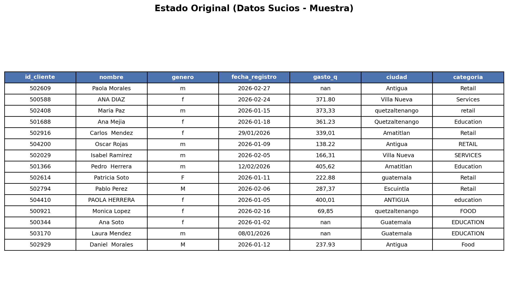
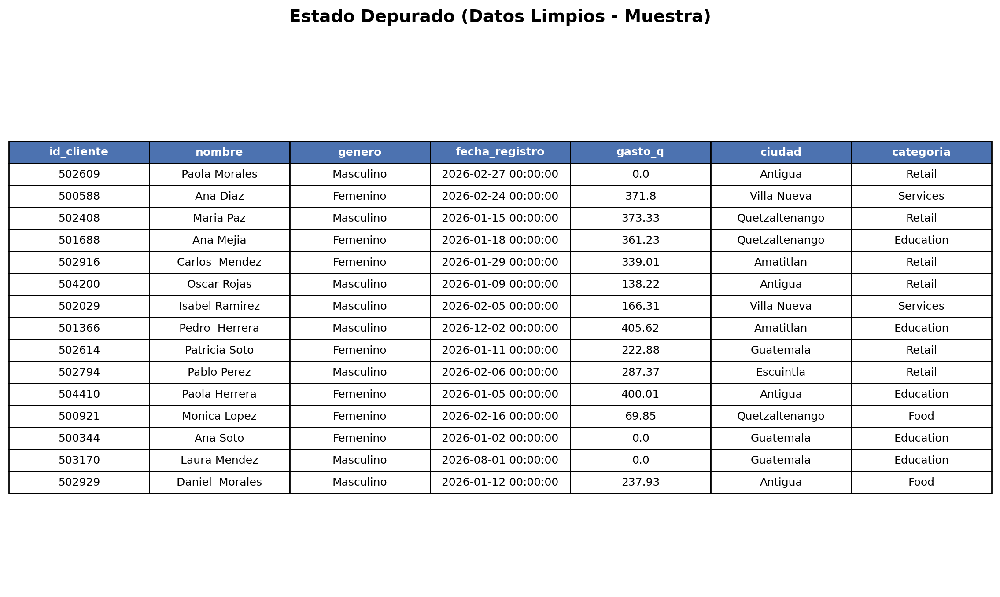
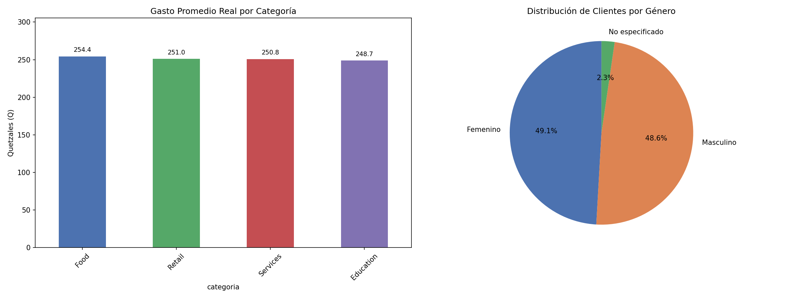

# Tarea #1 — Limpieza y Análisis Inicial de Datos con Python y Pandas

**Universidad San Carlos de Guatemala**
**Facultad de Ingeniería — Ingeniería en Ciencias y Sistemas**
**Curso:** Seminario de Sistemas 2

---

## 1. Dataset utilizado

**Nombre del archivo:** `dataset_sucio.csv`
**Tipo:** Dataset de clientes (registro de compras / gasto)
**Registros originales:** 5,000
**Columnas (7):**

| Columna | Descripción |
|---|---|
| `id_cliente` | Identificador numérico único del cliente |
| `nombre` | Nombre completo del cliente |
| `genero` | Género del cliente (`m`/`f`) |
| `fecha_registro` | Fecha de registro del cliente |
| `gasto_q` | Gasto del cliente en Quetzales (Q) |
| `ciudad` | Ciudad de residencia |
| `categoria` | Categoría de consumo (Food, Retail, Services, Education) |

El script utilizado (`main.py`) carga este archivo con Pandas, aplica el proceso de limpieza descrito abajo y exporta el resultado a `dataset_limpio.csv`.

---

## 2. Proceso de limpieza aplicado

### 2.1 Eliminación de duplicados
Se identificaron y eliminaron los registros con `id_cliente` repetido, conservando la primera ocurrencia.

- Registros originales: **5,000**
- Duplicados eliminados: **100**
- Registros únicos resultantes: **4,900**

### 2.2 Estandarización de texto
En todas las columnas de tipo texto se eliminaron espacios en blanco al inicio/final (`strip`). Adicionalmente:
- `nombre`, `ciudad` y `categoria` se normalizaron a formato **Title Case** (ej. `ANA DIAZ` / `ana diaz` → `Ana Diaz`), ya que el dataset original mezclaba mayúsculas, minúsculas y espacios extra (por ejemplo, `ciudad` tenía 24 variantes distintas para solo 8 ciudades reales).

### 2.3 Estandarización de género
La columna `genero` contenía las variantes `m`, `M`, ` m `, `f`, `F`, ` f ` y valores vacíos. Se homologó a:
- `m` → **Masculino**
- `f` → **Femenino**
- Valores vacíos/no reconocidos → **No especificado**

### 2.4 Estandarización de fechas
La columna `fecha_registro` mezclaba dos formatos: `YYYY-MM-DD` (ISO) y `DD/MM/YYYY`. Se aplicó una conversión en dos pasadas: primero como `YYYY-MM-DD`, y las fechas que no pudieron interpretarse se reprocesaron como `DD/MM/YYYY` (día primero).

- No se perdieron registros por fechas inválidas (0 nulos tras la conversión).
- **Limitación detectada:** cuando una fecha en formato `DD/MM/YYYY` tiene día y mes ambos ≤ 12 (ej. `12/02/2026`), la primera pasada la interpreta erróneamente como mes/día en vez de fallar, por lo que nunca llega a la segunda pasada de corrección. Ejemplo real en el dataset: el cliente *Pedro Herrera* (`id_cliente 501366`) tenía la fecha `12/02/2026` (12 de febrero), pero terminó guardada como `2026-12-02` (2 de diciembre). Este es un riesgo de calidad de datos a corregir en una futura iteración (por ejemplo, forzando `dayfirst=True` desde el inicio dado que el dataset es guatemalteco).

### 2.5 Estandarización de `gasto_q`
Algunos valores usaban coma decimal en vez de punto (ej. `373,33`), lo cual impedía tratarlos como número. Se reemplazó la coma por punto y se convirtió la columna a tipo numérico (`float`).

### 2.6 Tratamiento de valores/celdas vacías
- **`gasto_q` nulo:** 505 registros (≈10.1%) no tenían gasto reportado. Para no descartar a esos clientes del dataset final, se exportaron con **`0.0`** como marcador. *(Nota importante: para los cálculos de gasto promedio por categoría en el análisis visual, estos nulos se excluyeron del cálculo en vez de tratarse como 0, para no sesgar el promedio hacia abajo.)*
- **`ciudad` vacía o nula:** 157 registros sin ciudad se marcaron como **"Desconocida"** (222 en total tras la limpieza, incluyendo valores en blanco).
- **`genero` no reconocido:** se marcó como **"No especificado"**.

### 2.7 Exportación
El dataset limpio se exportó a `dataset_limpio.csv` con **4,900 filas × 7 columnas**, sin valores nulos.

---

## 3. Estado antes y después (tablas tipo pivote / muestra)

### 3.1 Estado original (datos sucios)
Muestra de los primeros 15 registros tal como llegaron en `dataset_sucio.csv`, mostrando inconsistencias de mayúsculas, formatos de fecha, separador decimal y valores `nan`.

### 3.2 Estado depurado (datos limpios)
Los mismos 15 registros después de aplicar el proceso de limpieza.

---

## 4. Visualizaciones generadas

- **Gasto promedio real por categoría:** barras que muestran el gasto promedio (excluyendo nulos) por categoría de consumo.
- **Distribución de clientes por género:** gráfica de pastel con el porcentaje de clientes Femenino, Masculino y No especificado.

---

## 5. Interpretación de resultados

- **Gasto por categoría:** el gasto promedio real es muy similar entre las cuatro categorías (Food Q254.4, Retail Q251.0, Services Q250.8, Education Q248.7), con una diferencia máxima de apenas Q5.7 entre la más alta y la más baja. Esto sugiere que, en este dataset, la categoría de consumo no es un factor que explique diferencias relevantes en el nivel de gasto de los clientes.
- **Distribución por género:** la base de clientes está prácticamente equilibrada entre Femenino (49.1%) y Masculino (48.6%), con un 2.3% sin especificar. No hay predominancia clara de un género sobre otro.
- **Calidad de los datos originales:** el dataset presentaba problemas típicos de captura manual: inconsistencia de mayúsculas/minúsculas, espacios extra, dos formatos de fecha y dos separadores decimales distintos, ~10% de gasto sin reportar y ~3% de ciudad sin reportar. Tras la limpieza, el dataset quedó estandarizado y sin duplicados, aunque se identificó un caso de ambigüedad en el parseo de fechas (ver sección 2.4) que debería revisarse antes de un análisis temporal más profundo (por ejemplo, tendencias de registro mes a mes).

---

## 6. Archivos entregados

| Archivo | Descripción |
|---|---|
| `main.py` | Script de limpieza y generación de visualizaciones |
| `dataset_sucio.csv` | Dataset original |
| `dataset_limpio.csv` | Dataset después de la limpieza |
| `estado_original.png` | Tabla muestra del estado original |
| `estado_depurado.png` | Tabla muestra del estado depurado |
| `analisis_visual.png` | Gráficas de gasto por categoría y distribución por género |
| `README.md` | Este documento |
