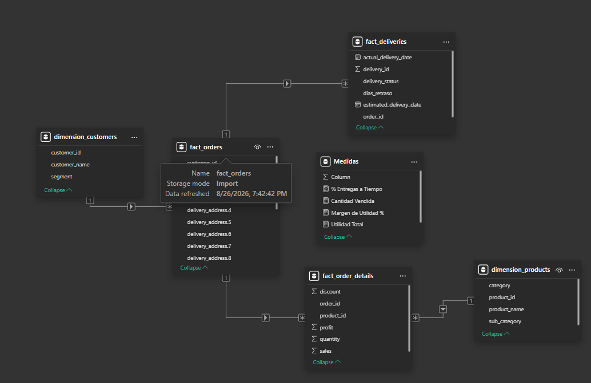
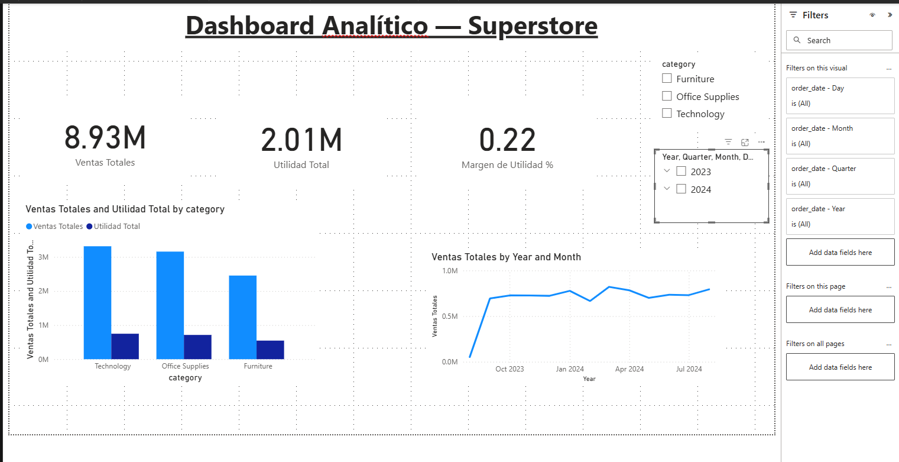

# Tarea #2 — Dashboard analítico en Power BI

**Universidad San Carlos de Guatemala — Facultad de Ingeniería — Ingeniería en Ciencias y Sistemas**
**Seminario de Sistemas 2 — Grupo G9**

## 1. Descripción del dataset

Dataset tipo *Superstore* (ventas minoristas), normalizado en 5 tablas relacionadas
(esquema estrella), obtenido de un repositorio público en GitHub
([honeycomb-maps/superstore-delivered](https://github.com/honeycomb-maps/superstore-delivered)).
Los archivos originales están en `dataset/`:

| Tabla                     | Filas  | Descripción                                                        | Llave(s)                          |
|---------------------------|--------|---------------------------------------------------------------------|------------------------------------|
| `dimension_customers.csv` | 1,000  | Catálogo de clientes: nombre y segmento (Consumer/Corporate/Home Office) | `customer_id` (PK)            |
| `dimension_products.csv`  | 500    | Catálogo de productos: nombre, categoría y subcategoría              | `product_id` (PK)                 |
| `fact_orders.csv`         | 5,000  | Cabecera de cada orden: cliente, fechas, modo de envío, dirección y totales | `order_id` (PK), `customer_id` (FK) |
| `fact_order_details.csv`  | 14,783 | Detalle por línea de producto de cada orden: ventas, cantidad, descuento y utilidad | `order_id` (FK), `product_id` (FK) |
| `fact_deliveries.csv`     | 5,000  | Estado de entrega de cada orden: fecha estimada vs. real y estatus   | `delivery_id` (PK), `order_id` (FK) |

## 2. Transformaciones realizadas (Power Query)

- Corrección de tipos de datos: fechas (`order_date`, `ship_date`, `estimated_delivery_date`,
  `actual_delivery_date`) a tipo Fecha; montos (`sales`, `profit`, `total_sales`,
  `total_profit`) a Número decimal; `discount` a Porcentaje; cantidades a Número entero.
- Limpieza de texto (Trim) en `customer_name`, `category` y `sub_category`.
- Eliminación de columnas no utilizadas en el análisis (`delivery_lat`, `delivery_lon`,
  `delivery_h3`) para simplificar el modelo.
- Columna calculada `dias_retraso` en `fact_deliveries` (diferencia entre fecha real y
  fecha estimada de entrega).

## 3. Modelo de datos (relaciones)

| Tabla (muchos)        | Columna     | Tabla (uno)          | Columna     | Cardinalidad |
|-----------------------|-------------|----------------------|-------------|--------------|
| `fact_orders`         | customer_id | `dimension_customers`| customer_id | Muchos a 1   |
| `fact_order_details`  | product_id  | `dimension_products` | product_id  | Muchos a 1   |
| `fact_order_details`  | order_id    | `fact_orders`        | order_id    | Muchos a 1   |
| `fact_deliveries`     | order_id    | `fact_orders`        | order_id    | 1 a 1        |

## 4. Dashboard

Visualizaciones incluidas (mínimo 3 exigido, aquí 7):

1. Tarjeta — Ventas Totales
2. Tarjeta — Utilidad Total
3. Tarjeta — Margen de Utilidad %
4. **Gráfico comparativo** de columnas agrupadas — Ventas y Utilidad por Categoría
5. Gráfico de líneas — Ventas por mes (tendencia temporal)
6. Gráfico de dona — Participación de ventas por Segmento de cliente
7. **Segmentador** — Categoría de producto

## 5. Interpretación de los KPIs

*(Cifras calculadas directamente sobre el dataset; deben coincidir con lo que muestran
las tarjetas del dashboard una vez construido en Power BI)*

- **Ventas Totales: Q 8,928,993.67** — con una **Utilidad Total de Q 2,005,637.55**,
  lo que da un **margen de utilidad del 22.5%**, consistente entre categorías
  (Technology 22.5%, Office Supplies 22.6%, Furniture 22.2%). Esto indica que la
  rentabilidad no depende fuertemente de la categoría, sino que probablemente está
  ligada de forma más homogénea a la política de descuentos.
- **Ventas por categoría**: Technology lidera con Q 3,315,470.66 (37.1% del total),
  seguido de Office Supplies (Q 3,158,297.89, 35.4%) y Furniture (Q 2,455,225.12,
  27.5%). La diferencia entre categorías es moderada, sin una categoría dominante
  aplastante.
- **Ventas por segmento de cliente**: distribución muy pareja entre Consumer
  (Q 3,002,879.87), Home Office (Q 2,977,365.49) y Corporate (Q 2,948,748.31) — ningún
  segmento representa más del 34% del total, lo que sugiere una base de clientes
  diversificada y sin dependencia de un solo tipo de cliente.
- **Modo de envío**: relativamente equilibrado entre First Class (1,274 órdenes),
  Same Day (1,272), Standard Class (1,233) y Second Class (1,221).
- **Estado de entregas**: solo el **25.6% de las entregas** están marcadas como
  "Delivered" a tiempo; el resto se reparte entre Failed (25.0%), Delayed (25.0%) y
  In Transit (24.4%). Esta es la señal más importante del dashboard: **1 de cada 4
  entregas falla**, lo cual amerita una revisión del proceso logístico o del
  proveedor de envíos si estos datos reflejaran una operación real.

